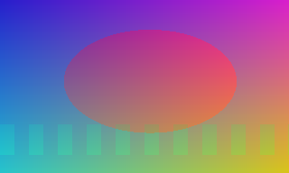
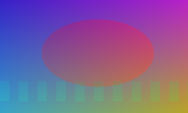
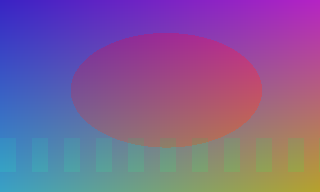
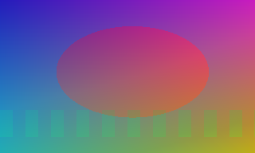
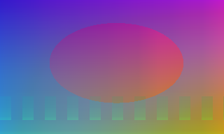
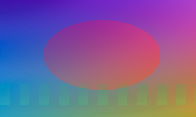
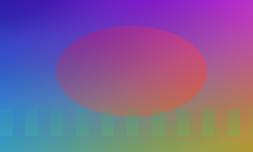
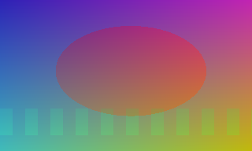

# Color Match To Reference — Guide

## Назначение
Подгонка цвета `image` к `reference` по методам (`mean_std`, `linear`, `tone_curve`, `adain`, `optimal_transport`, `lab_cdf`, `oklab_cdf`, `perceptual_vgg_fast`).

## Когда использовать
- Стабилизация цвета между кадрами/источниками.
- Компенсация тоновых сдвигов после генерации видео.
- Быстрый перенос базовой цветокоррекции с референса.

## Минимальный сценарий (3 шага)
1. Подайте `reference` и `image`.
2. Выберите `preset` и при необходимости `strength`.
3. Проверьте `match_json.quality` и визуально сравните результат.

## Параметры
| Параметр | Что делает | Рекомендация |
|---|---|---|
| `reference` | Эталон цвета | Кадр/изображение нужного look |
| `image` | Что корректируем | Текущий кадр/изображение |
| `preset` | Метод цветокоррекции | `mean_std` — быстро, `linear` — дефолт, `tone_curve` — подгонка контраста, `adain` — быстро и перцептивно, `optimal_transport` — Wasserstein, `lab_cdf` — Lab, `oklab_cdf` — Oklab (лучше), `auto_optimal` — автовыбор linear/oklab_cdf, `perceptual_vgg_fast` — VGG |
| `strength` | Сила применения [0..1] | 0.6-0.9 для мягкой коррекции |
| `match_mask` | Где считать статистику | Белое = учитывать |
| `apply_mask` | Где применять коррекцию | Белое = применять |
| `preserve_alpha` | Сохранить альфу | Оставляйте `true` для RGBA |
| `compute_quality_metrics` | Legacy-флаг метрик | `false` принудительно выключает метрики |
| `quality_metrics_mode` | Режим расчета метрик | `off` / `fast` (`mse+ssim`) / `full` |
| `auto_optimal_metric` | Критерий выбора в `auto_optimal` | `mse_ssim` (баланс), `mse_ssim_lpips` (точнее, медленнее) |
| `auto_temporal_stability` | Стабилизация выбора в `auto_optimal` | Для видео последовательностей |
| `auto_temporal_alpha` | EMA сглаживание оценки | 0.75 по умолчанию |
| `auto_switch_threshold` | Порог переключения между `linear` и `oklab_cdf` | Больше значение = меньше переключений |
| `auto_quality_fallback` | Разрешить fallback на тяжелый метод при низком качестве `auto_optimal` | Для сложных сцен/смешанного света |
| `auto_fallback_method` | Метод fallback в `auto_optimal` | `lab_cdf`, `oklab_cdf`, `perceptual_vgg_fast` |
| `auto_fallback_threshold` | Порог score, после которого запускается fallback | 0.05 по умолчанию |
| `auto_fallback_margin` | Минимальный выигрыш score для принятия fallback | 0.001 по умолчанию |
| `spatial_grid` | Локальный матчинг по сетке NxN | Работает для `linear`, `mean_std`, `adain`, `auto_optimal` |
| `skin_tone_protection` | Защита оттенков кожи | Полезно для портретов |
| `skin_protection_strength` | Сила защиты кожи | 0.0-1.0 |
| `export_lut` | Экспорт LUT `.cube` | Включайте для передачи цветокоррекции в монтаж/грейдинг |
| `lut_size` | Размер 3D LUT | 17 для скорости, 33 для качества |
| `lut_output_dir` | Папка для LUT | Пусто = `./output/color_luts` |
| `lut_name` | Базовое имя LUT | Например `sceneA_match` |

## Decision helper
- Нужна максимальная скорость → `mean_std` (быстрый, базовый) или `adain` (хороший баланс).
- Нужен стабильный режим → `linear` (линейная подгонка, дефолт).
- Нужна подгонка контраста/экспозиции → `tone_curve`.
- Нужна математически обоснованная подгонка → `optimal_transport` (Wasserstein distance).
- Нужно лучше качество → `lab_cdf` (Lab гистограмма) или `oklab_cdf` (перцептивнее).
- Нужен автоподбор без ручного выбора метода → `auto_optimal`.
- Для видео с `auto_optimal`: включите `auto_temporal_stability` и при необходимости увеличьте `auto_switch_threshold`.
- Для сложных кадров в `auto_optimal`: включите `auto_quality_fallback` и подберите `auto_fallback_threshold`.
- Для локальных перепадов освещения: включите `spatial_grid` (обычно 2-4).
- Максимум качества → `perceptual_vgg_fast` (нейросеть, медленный).

## Сравнение методов цветокоррекции

### Полная таблица

| Метод | Алгоритм | Скорость | Качество | Лучший для |
|-------|----------|----------|----------|-----------|
| `mean_std` | Per-channel mean/std match | ⚡⚡⚡ | ⭐ | Максимальная скорость, черновые работы |
| `linear` | Linear regression per-channel (RGB) | ⚡⚡ | ⭐⭐ | **Стандартный выбор (дефолт)** |
| `tone_curve` | Tone mapping via quantile-based curve | ⚡⚡ | ⭐⭐ | Матчинг контраста и динамического диапазона |
| `adain` | Adaptive Instance Normalization | ⚡⚡ | ⭐⭐⭐ | Перцептивная нормализация |
| `optimal_transport` | Wasserstein distance (монотонное отображение) | ⚡ | ⭐⭐⭐ | Математически обоснованное распределение (новый) |
| `lab_cdf` | Histogram CDF equalization в Lab | ⚡ | ⭐⭐⭐ | Хорошее качество, универсальность |
| `oklab_cdf` | Histogram CDF equalization в **Oklab** | ⚡ | ⭐⭐⭐⭐ | **Лучшее качество, перцептивно улучшенный** |
| `auto_optimal` | Автовыбор `linear`/`oklab_cdf` по MSE | ⚡ | ⭐⭐⭐⭐ | Быстрый и надежный выбор без ручного тюнинга |
| `perceptual_vgg_fast` | VGG19 feature optimization | 🐢 | ⭐⭐⭐⭐⭐ | Максимальное качество, готовые композиты |

### Сравнение пресетов (Скорость / Точность / Детали)

| Метод | Скорость | Точность цвета | Сохранение деталей |
|---|---|---|---|
| `mean_std` | Очень высокая | Низкая-средняя | Среднее |
| `linear` | Высокая | Средняя | Хорошее |
| `tone_curve` | Высокая | Средняя | Хорошее в тенях/светах |
| `adain` | Высокая | Средняя-хорошая | Хорошее |
| `optimal_transport` | Средняя | Хорошая | Хорошее |
| `lab_cdf` | Средняя | Хорошая | Среднее-хорошее |
| `oklab_cdf` | Средняя | Очень хорошая | Хорошее |
| `auto_optimal` | Средняя | Очень хорошая | Хорошее |
| `perceptual_vgg_fast` | Низкая | Максимальная | Очень хорошее |

## Визуальные примеры
- Все примеры ниже построены на одном и том же наборе (`case01`): слева `До`, справа результат выбранного `preset`.
- Папка с файлами: `guides/assets/color_match_examples/case01/`.
- Референс для примеров: `guides/assets/color_match_examples/case01/reference.png`.
- Перегенерация примеров: `python guides/assets/color_match_examples/generate_case01.py`.

| Метод | До | После |
|---|---|---|
| `mean_std` |  |  |
| `linear` |  |  |
| `tone_curve` |  |  |
| `adain` |  |  |
| `optimal_transport` |  |  |
| `lab_cdf` |  |  |
| `oklab_cdf` |  |  |
| `auto_optimal` |  |  |
| `perceptual_vgg_fast` |  |  |

### Технические различия

**mean_std vs linear:**
- `mean_std`: выравнивает средние и стандартные отклонения каналов (быстро, но теряет тона)
- `linear`: применяет линейное преобразование scale+offset (лучше сохраняет контраст)

**tone_curve:**
- Подгоняет люминансность через кривую тонов на основе квантилей
- Вычисляет 5 точек: черный (0%), темные (25%), средний (50%), светлые (75%), белый (100%)
- Хорошо работает с видео при различных условиях освещения
- Сохраняет детали в тенях и светах лучше чем линейные методы

**adain:**
- Adaptive Instance Normalization из neural style transfer
- Нормализует каждый RGB канал отдельно: `(x - mean_src) / std_src * std_ref + mean_ref`
- Быстро и стабильно, хороший баланс между качеством и скоростью
- Менее чувствителен к экстремальным значениям
- Хорошо для быстрой цветокоррекции и нормализации батчей

**optimal_transport:**
- Решает 1D задачу оптимального транспорта (Wasserstein distance)
- Сортирует пиксели источника и эталона, затем матчит их монотонно
- Математически обоснованное: находит оптимальное распределение между двумя гистограммами
- Лучше чем tone_curve благодаря более строгому фундаменту
- Хорошо для полной переподгонки распределения пиксельных значений

**lab_cdf vs oklab_cdf:**
- `lab_cdf`: использует Lab пространство (стандарт, хорошо зарекомендовано)
- `oklab_cdf`: использует **Oklab** пространство (современное, более перцептивно корректное)
  * Oklab лучше сохраняет визуальное восприятие цветовых изменений
  * Oklab имеет более линейный эффект восприятия (uniform perceptual space)
  * Результаты часто выглядят естественнее без артефактов

**Рекомендация:** Если есть сомнения между `lab_cdf` и `oklab_cdf` — выбирайте `oklab_cdf`. Скорость практически идентична, но качество заметно лучше.

## Интерпретация выходов
- `matched_image`: скорректированное изображение.
- `match_json`: параметры коррекции + блок `quality`.
- При `export_lut=true`: в `match_json.lut` возвращается путь к сохранённому `.cube`.

Пример `quality`:
```json
{
  "quality": {
    "before": {"mse": 0.012, "ssim": 0.82, "delta_e76": 7.1, "lpips_alex": 0.24},
    "after": {"mse": 0.006, "ssim": 0.90, "delta_e76": 4.3, "lpips_alex": 0.16},
    "improvement_pct": {"mse": 50.0, "ssim": 9.756, "delta_e76": 39.437, "lpips_alex": 33.333}
  }
}
```

## Численные ориентиры качества
- `mse`: ниже лучше. Отлично: `<0.005`, приемлемо: `0.005-0.02`, плохо: `>0.02`.
- `ssim`: выше лучше. Отлично: `>0.92`, приемлемо: `0.80-0.92`, плохо: `<0.80`.
- `delta_e76`: ниже лучше. Отлично: `<3`, приемлемо: `3-8`, плохо: `>8`.
- `lpips_alex`: ниже лучше. Отлично: `<0.12`, приемлемо: `0.12-0.30`, плохо: `>0.30`.

## Рекомендации по использованию

### По сценариям

**Быстрая обработка батча (production):**
- Используйте `linear` (скорость + качество) или `adain` (еще быстрее)
- Strength: 0.8–1.0
- Без масок если не требуется выборочное применение
- `compute_quality_metrics=false` для максимальной скорости

**Видео кадр-в-кадр стабилизация:**
- Стартуйте с `linear` для стандартных случаев
- Если видна цветовая нестабильность → `tone_curve` (для экспозиции) или `optimal_transport` (для полного матчинга) или `oklab_cdf` (для глубокой коррекции)
- Strength: 0.6–0.8 (избегайте перекоррекции)
- Используйте `match_mask` если нужно исключить области

**Реставрация/архивные материалы:**
- Начните с `oklab_cdf`
- Если результат слишком контрастный → попробуйте `lab_cdf`
- Strength: 0.5–0.9 (зависит от целевого результата)

**Финальный проход (высокое качество):**
- `oklab_cdf` или `perceptual_vgg_fast`
- Strength: 1.0 (полная коррекция)
- Используйте `apply_mask` если нужна локальная подстройка

### Tuning параметров

**`strength` (интенсивность коррекции):**
- 0.3–0.5: Мягкая подстройка, сохраняет оригинальный вид
- 0.6–0.8: Сбалансированная коррекция (рекомендуется)
- 0.9–1.0: Полная коррекция к эталону

**`match_mask` (где брать статистику):**
- Используйте если эталон имеет нежелательные области (тени, шум)
- Маска белого цвета = используется для расчета статистики
- Быстрый способ: маска переднего плана, исключить фон

**`apply_mask` (где применять коррекцию):**
- Используйте если результат должен быть применен только к части
- Белое = применить коррекцию, черное = оставить исходное
- Примечание: маски замедляют обработку на ~20%

## Типовые ошибки и решения
- Перекоррекция: снизьте `strength`.
- Недокоррекция: `linear → lab_cdf`/`oklab_cdf` или `perceptual_vgg_fast`.
- Проблема только в области: используйте `match_mask` и `apply_mask`.
- Пустая `match_mask` (нет белых пикселей): нода возвращает исходное изображение для такого кадра и пишет warning в лог.
- Слишком частые переключения `auto_optimal` между кадрами: включите `auto_temporal_stability`, увеличьте `auto_temporal_alpha` и/или `auto_switch_threshold`.
- Если `auto_optimal` иногда «не дотягивает»: включите `auto_quality_fallback` и уменьшите `auto_fallback_threshold`.
- Если кадр неравномерно освещен: включите `spatial_grid` (2-4) для локального матчинга.
- `perceptual_vgg_fast` недоступен: проверьте `torchvision` в среде ComfyUI.

## Производительность
- Скорость методов: `mean_std` > `linear` > `lab_cdf` ≈ `oklab_cdf` > `perceptual_vgg_fast`.
- Маски и большие разрешения увеличивают время.
- `perceptual_vgg_fast` может быть заметно медленным на 2K/4K.
- `delta_e76` в `quality_metrics_mode=full` считается torch-формулой и не требует `cv2`.
